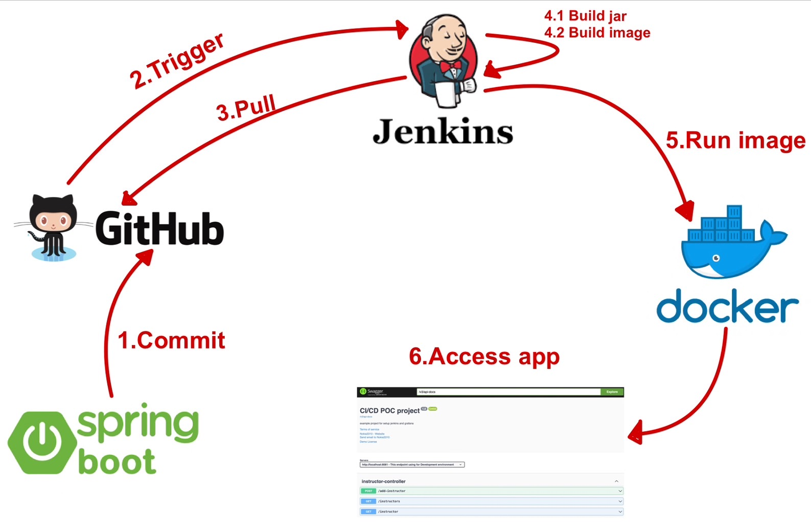
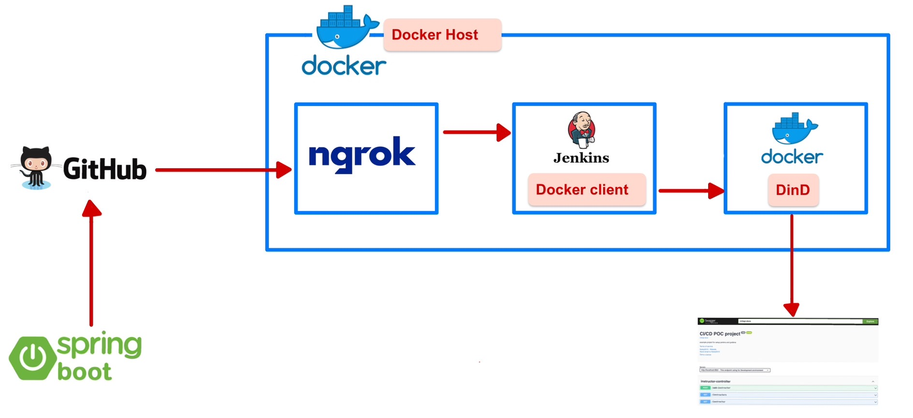

# spring-boot-container-cicd
## Introduction
CI/CD stands as a crucial concept in modern software development, dismantling barriers between development and operations teams. It fosters collaborative responsibilities, bringing synergy to the goals of both development and operations. In this article, I will guide you through a brief POC on integrating Git and Jenkins. While this article may not encompass an exhaustive list of other DevOps tools like Prometheus, Grafana, Jira, etc., it aims to provide a foundational understanding of Git-Jenkins integration

## Scenario
<p align="center">
  
</p>
As depicted in the illustration above, the steps are outlined below:

`1.`Create a Spring Boot application and commit the source code to GitHub.\
`2.`Upon a new commit, the GitHub webhook will initiate a trigger to Jenkins.\
`3.`Jenkins, upon receiving the trigger, will pull the latest source code from GitHub.\
`4.1.` Execute the Maven command "mvn clean install" to build the JAR artifact.\
`4.2.` Utilize a predefined Dockerfile to build a Docker image. This process requires the JAR artifacts generated in step 4.1 to be included in the image packaging.\
`5.`Run container from Docker image created in step 4.2 within the Docker engine.\
`6.`The anticipated outcome is the ability to access Swagger UI, indicating the successful functioning of our application!\

## Prerequisite for Host 
1.Github account\
3.Docker engine and install Docker Compose 

## Docker Compose 
This POC's going to setup everything based on Docker Compose, making it easy to start up all the components and integrate all of them to collaborate with each other.\
The components that will start up with Docker Compose are the following:
>1.docker:dind\
>2.jenkins\
>3.ngrok

<p align="center">
  
</p>

#### Docker in Docker (DinD) 
In an environment where all components are containerized, it is necessary to provide Jenkins with a Docker engine to facilitate image building and container execution.\
In this scenario, the use of `docker:dind` is crucial. The `docker:dind` container encompasses both clients, daemons, and a registry. Consequently, after Jenkins completes the image building process, it pushes the images to the `docker:dind` container and initiates the application as a container. This approach is commonly referred to as `Docker in Docker`.

Refer document : [How To Run Docker in Docker Container](https://devopscube.com/run-docker-in-docker/)

#### Jenkins custom images
When utilizing Jenkins in a container, relying on the official `jenkins/jenkins` image may not be sufficient. This is because the Jenkins container needs to install a `Docker client` to connect to `docker:dind` for tasks like pushing application images and running application containers. As a result, it becomes necessary to create custom Jenkins images that include the `Docker client`. The Docker client will then be available within the Jenkins container, enabling seamless interaction with Docker functionalities.\
To build custom Jenkins images with the Docker client, do the following:
 ```Dockerfile
FROM jenkins/jenkins:2.426.1-jdk17
USER root
RUN apt-get update && apt-get install -y lsb-release
RUN curl -fsSLo /usr/share/keyrings/docker-archive-keyring.asc \
  https://download.docker.com/linux/debian/gpg
RUN echo "deb [arch=$(dpkg --print-architecture) \
  signed-by=/usr/share/keyrings/docker-archive-keyring.asc] \
  https://download.docker.com/linux/debian \
  $(lsb_release -cs) stable" > /etc/apt/sources.list.d/docker.list
RUN apt-get update && apt-get install -y docker-ce-cli
USER jenkins
RUN jenkins-plugin-cli --plugins "blueocean docker-workflow"
 ```
Then run the Docker command to build images from the script above.
 ```docker
docker build -f ./path/of/Dockerfile -t name-of-image .
 ```

[Creating webhooks](https://docs.github.com/en/webhooks/using-webhooks/creating-webhooks)
[Testing webhooks](https://docs.github.com/en/webhooks/testing-and-troubleshooting-webhooks/testing-webhooks)


[Jenkins Docker](https://www.jenkins.io/doc/book/installing/docker/)


[Protect the Docker daemon socket](https://docs.docker.com/engine/security/protect-access/)

[I want to connect from a container to a service on the host](https://docs.docker.com/desktop/networking/#i-want-to-connect-from-a-container-to-a-service-on-the-host)

test commit1 01

Remote Docker Daemon

 ```
properties([parameters([string(defaultValue: '0.0', description: 'Docker image version', name: 'DOCKER_IMAGE_VERSION')])])

pipeline {
    agent any
    
    tools {
        maven 'maven01'
    }

    stages {
        stage('Checkout') {
            steps {
                git branch: 'main', url: 'https://github.com/santipabWannakiri/spring-boot-container-cicd.git'
            }
        }

        stage('Build') {
            steps {
                script {
                    echo 'Building with Maven:'
                    withMaven(maven: 'maven01') {
                        sh 'mvn clean install'
                    }
                }
            }
        }

        stage('Build Docker Image') {
            steps {
                script {
                    echo "Building Docker image with version: ${params.DOCKER_IMAGE_VERSION}"
                    sh "docker build -f ./container/dockerFile/springAppContainer -t app/spring-boot-cicd:${params.DOCKER_IMAGE_VERSION} ."
  
                }
            }
        }
        
                stage('Start container') {
            steps {
                script {
                    echo "Starting container: app/spring-boot-cicd:${params.DOCKER_IMAGE_VERSION}"
                    sh "docker run -p 8081:8081 -d app/spring-boot-cicd:${params.DOCKER_IMAGE_VERSION}"
  
                }
            }
        }
        
    }

    post {
        success {
            echo 'Pipeline succeeded!'
        }
        failure {
            echo 'Pipeline failed!'
        }
    }
}

 ```
